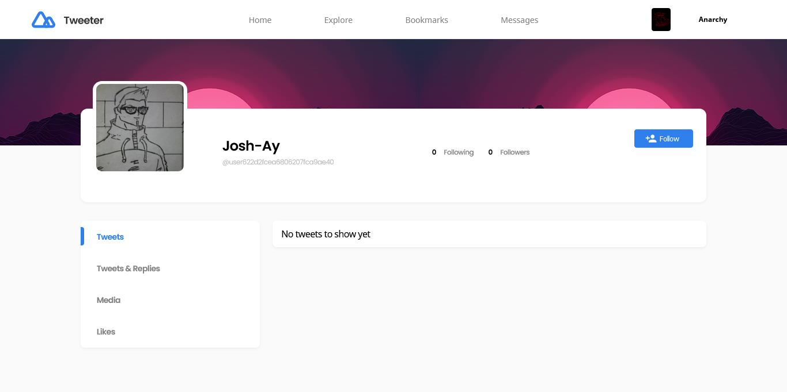
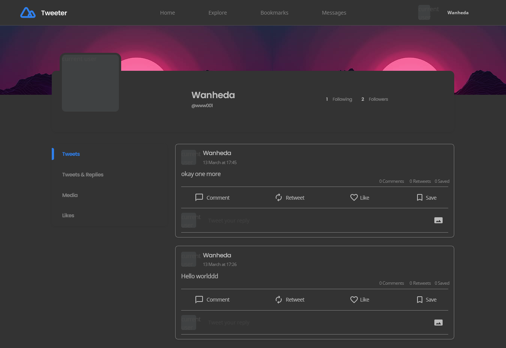
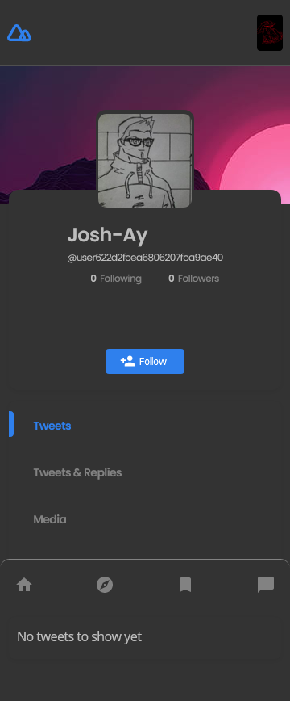
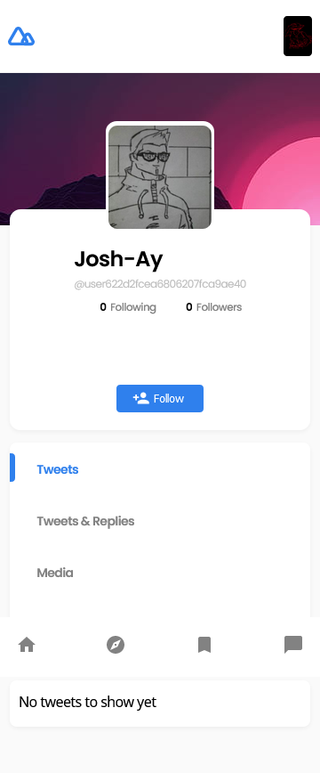

<h1 align="center">Tweeter - Twitter Clone</h1>

<div align="center">
   A Twitter clone application as a solution for a challenge from  <a href="http://devchallenges.io" target="_blank">Devchallenges.io</a>.
</div>
<br/>
<div align="center">
  <h3>
    <a href="https://tweeter-clone-app.netlify.app/">
      Demo
    </a>
    <span> | </span>
    <a href="https://devchallenges.io/solutions/HCgGxyC86unwYQo2MAgD">
      Solution
    </a>
    <span> | </span>
    <a href="https://devchallenges.io/challenges/rleoQc34THclWx1cFFKH">
      Challenge
    </a>
  </h3>
</div>
<br/>
<!-- TABLE OF CONTENTS -->

## Table of Contents

- [Solution Walthrough](#solution-walkthrough)
- [Overview](#overview)
- [Built With](#built-with)
  - [Frontend](#frontend)
  - [Backend](#backend)
- [Features](#features)
- [How to use](#how-to-use)
- [Contact](#contact)
- [Acknowledgements](#acknowledgements)

## Solution Walkthrough


<!-- OVERVIEW -->

## Overview







## Built With

<!-- This section should list any major frameworks that you built your project using. Here are a few examples.-->

### Frontend
The following were used in the building of the frontend of this application:
- HTML
- SASS/CSS
- [Javascript](https://developer.mozilla.org/en-US/docs/Web/JavaScript)
- [NPM](https://www.npmjs.com/)
- [React](https://reactjs.org/)
- [Axios](https://www.npmjs.com/package/axios)
- [React Responsive](https://www.npmjs.com/package/react-responsive)
- [Socket.io Client](https://www.npmjs.com/package/socket.io-client)
- [Crypto Js](https://www.npmjs.com/package/crypto-js)
- [Dotenv](https://www.npmjs.com/package/dotenv)
- [Qs](https://www.npmjs.com/package/qs)

### Backend
The following were used in the building of the backend of this application:

- [AWS SDK](https://www.npmjs.com/package/aws-sdk)
- [Connect Mongo](https://www.npmjs.com/package/connect-mongo#connection-to-mongodb)
- [Cors](https://www.npmjs.com/package/cors)
- [Crypto Js](https://www.npmjs.com/package/crypto-js)
- [Dotenv](https://www.npmjs.com/package/dotenv)
- [Express.js](https://expressjs.com/)
- [Express session](https://www.npmjs.com/package/express-session)
- [Mongoose](https://mongoosejs.com/)
- [Mongoose FindOrCreate](https://www.npmjs.com/package/mongoose-find-or-create)
- [Multer](https://www.npmjs.com/package/multer)
- [Nodemon](https://www.npmjs.com/package/nodemon)
- [PassportJS](https://www.passportjs.org/)
- [Socket.io](https://www.npmjs.com/package/socket.io)

## Features

This web application/site was created as a submission to a [DevChallenges](https://devchallenges.io/challenges) challenge. The [challenge](https://devchallenges.io/challenges/rleoQc34THclWx1cFFKH) was to build an application to complete the following user stories:

- User story: I can register a new account

- User story: I can log in

- User story: I can log in or register with at least one of the following services: Google, Facebook, Twitter or Github

- User story: I can sign out

- User story: I can edit my details including: profile and cover photo, name, bio

- User story: I can upload a new photo for my profile photo or cover photo

- User story: I can see my profile or others' profile

- User story: When I am on a profile, I can see Tweets and Retweets. I can also filter by Tweets, Tweets and replies, Media and Likes

- User story: When I am on a profile, I can see followers and following

- User story: When I am on a profile, I can see follow or unfollow the user

- User story: I can navigate between Home, Explore, Bookmarks and Messages

- User story: I can navigate to My Profile, Group Chat (optional), Setting/Authentication App.

- User story: When I am on Home, I can post a new Tweet

- User story: When I post a new Tweet, I can choose to upload an image and set the Tweet to be public or only-follower

- User story: When I am on Home, I can see Tweets of people who I follow

- User story: I can Comment, Retweet, Like or Save a Tweet

- User story: I can Comment with image and I can like a comment

- User story: I can see the posted time of the Comments and Tweets

- User story: When I am on Home, I can see the most popular hashtags and people I should follow (it's up to you how to implement this)

- User story: When I am on Explore, I can see the Top, Latest Tweet, or Tweet with Media. I can also choose to see the most popular people

- User story: When I am on Bookmarks, I can see the Saved Tweet

### Added User Stories
- User story: When I am on Messages, I can see messages that I have started with others

- User story: When I am on Messages, the messages that I have started with others should be sorted starting from the last message received

- User story: When I am on Messages, I can start a new chat with those I follow and search through the people I follow to start a chat with

- User story: When I am on Messages, I can see the details of the person I am currently chatting with and navigate to their profile

- User story: When I am on Messages, I can send a message and receive messages

- User story: When I am on Messages, I can choose to upload an image

- User story: When I am on Messages, I can see the created time of the sent or received message 

## How To Use

<!-- Example: -->

To clone and run this application, you'll need [Git](https://git-scm.com) and [Node.js](https://nodejs.org/en/download/) (which comes with [npm](http://npmjs.com)) installed on your computer. From your command line:

```bash
# Clone this repository
$ git clone https://github.com/Josh-Ay/twitter-clone.git

```
- Go into the 'client' folder

```bash
# Go into client folder
$ cd client/
```
- Create a new .env file and set the following to anything you like:
  1. REACT_APP_API_URL=http://localhost:5000 (the server runs on port 5000)
  2. REACT_APP_AES_SECRET_KEY=anythingyouwant (but it should be the same as the one you would also set in the .env file that you would soon create backend folder)

```bash
# Install all dependencies
$ npm install
```

- `cd` out of the 'client' folder and into the 'server' folder
```bash
# cd out of 'client' and into 'server' folder
$ cd ../server
```
- Create a new .env file and set the following:
  1. SESSION_SECRET=anythingyouwant
  2. GOOGLE_CLIENT_ID, GOOGLE_CLIENT_SECRET (check out this [link](https://www.youtube.com/watch?v=7K9kDrtc4S8&t=3885s) to know how to set these up)
  3. GITHUB_CLIENT_ID, GITHUB_CLIENT_SECRET (check out this [link](https://www.youtube.com/watch?v=wcUdBgktd4s) to know how to set these up)
  4. FACEBOOK_APP_ID, FACEBOOK_APP_SECRET (check out this [link](https://www.youtube.com/watch?v=KlE9RAOl9KA) to know how to set these up)
  5. SALT_LENGTH=a number e.g 2, 4, 6
  6. AES_SECRET_KEY=anythingyouwant (it should match the one you created in the .env file in your 'client' folder)
  7. CLIENT_URL=http://localhost:3000 (the client 'react' runs on port 3000)
  8. AWS_BUCKET_NAME, AWS_BUCKET_REGION=us-east-2,AWS_ACCESS_KEY, AWS_SECRET_KEY (check out this [link](https://youtu.be/NZElg91l_ms) to know how to set these up)
  9. API_URL=http://localhost:5000 (the server is running on port 5000)

```bash
# Install all dependencies
$ npm install
```
- Go to line 60 in the 'app.js'
```bash
# line 60
// mongoose.connect("mongodb://localhost:27017/tweeterDB")    // localuse
```
- uncomment it and comment out line 61
```bash
# line 61
mongoose.connect(process.env.MONGO_DB_URI);     // mongo atlas
```

- copy the mongo url on line 60 i.e `"mongodb://localhost:27017/tweeterDB"`
- navigate to 'middleware' folder and locate the 'config.js' file
- now, replace the 'process.env.MONGO_DB_URI' on line 23 with what you copied above

```bash
# line 23(before)
store: MongoStore.create({ mongoUrl: process.env.MONGO_DB_URI }),
```

```bash
# line 23(it should now be this)
store: MongoStore.create({ mongoUrl: mongodb://localhost:27017/tweeterDB }),
```


- save all changes

```bash
# Run the server
$ node app.js
```

- open up a new terminal and cd into the 'clients/' folder in the new terminal


```bash
# Run the react app
$ npm start
```

- That's it. You're all done!!

<br />

## Acknowledgements
The following links were very helpful to me in the course of building this project and I feel they could also be useful to you too in your future endeavours: 

- [Social OAuth with React](https://www.youtube.com/watch?v=7K9kDrtc4S8&t=3885s)
- [Create an array of refs using react](https://www.youtube.com/watch?v=ygPIjzhKB2s)
- [Upload images to s3](https://youtu.be/NZElg91l_ms)
- [Socket.io crash course](https://youtu.be/ZKEqqIO7n-k)
- [Chat app with react](https://youtu.be/NU-HfZY3ATQ)
- [Model-View-Controller(MVC) pattern with Express and Node.js](https://www.youtube.com/watch?v=Cgvopu9zg8Y&t=534s)
- [MVC in 4mins](https://www.youtube.com/watch?v=DUg2SWWK18I&t=3s)

## Contact

- GitHub [@Josh-Ay](https://{github.com/Josh-Ay})
